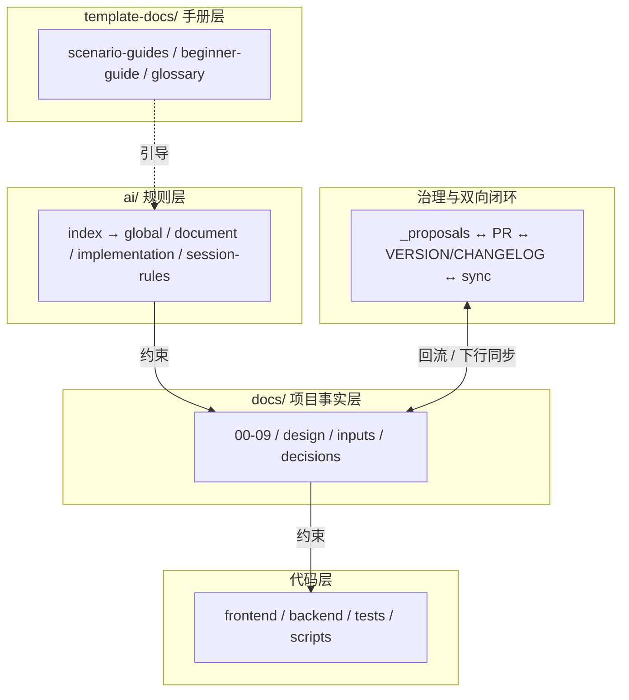
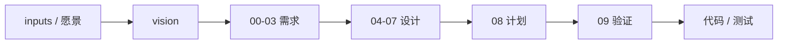
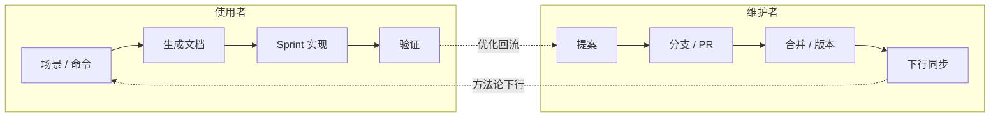

# ai-project-template

这是一套**用 AI 按软件工程规范开发软件**的项目模板。

直接让 AI 写代码，往往产出难维护、缺文档、不规范。本模板反过来——先让 AI 按规范生成各阶段工程文档（需求、架构、设计、计划、验证），再让 AI 在这些文档约束下写代码。这样你既能得到完整规范的过程文档，又能让代码符合设计、可审查、可维护。一套模板，跨项目复用。

> **两类读者**：使用者（基于模板做派生项目）看本 `README.md` + `template-docs/beginner-guide.md`；模板维护者（维护本仓库）看 `MAINTAINERS.md`。

## 模板一览

**分层架构**（规则层约束事实层与代码层；手册层引导；治理层双向闭环）：

**文档驱动设计流程**（输入 → 需求 → 设计 → 计划 → 验证 → 代码，对齐 `ai/document-lifecycle-rules.md` §2）：

**使用 / 维护双向闭环**（使用者：场景→文档→实现→验证；维护者：提案→PR→同步；优化回流，见 `CONTRIBUTING.md` §2）：

## 它能做什么

- **生成工程文档体系**：给 AI 你的需求 / 愿景 / 想法，它按软件工程规范生成需求 → 架构 → 技术方案 →（数据库 → 接口）→ 开发计划 → 验证各阶段文档；支持多种输入起步（愿景 / PRD / SRS / 任务单 / 小工具 brief）。
- **文档约束代码 + 合规审查**：AI 按文档实现，不自由发挥；六维度审查（需求 / 架构 / 技术 / 数据库 / 接口 / 边界）保证代码符合设计、不越出当前阶段。
- **分阶段交付**：把完整设计拆成 Demo → MVP → 产品 增量实现；文档只增不删，随阶段积累演进。
- **场景引导**：在 AI CLI 里说一个具体场景（如「帮我新建项目」「帮我规划阶段」），AI 给「做什么 + 为什么」分步引导计划，确认后执行；按使用者 / 维护者 / 元场景覆盖从零起步到 Phase 升级的完整旅程。
- **跨项目复用 + 经验回流**：一套模板派生多个项目，方法论下行同步统一；派生项目发现的可通用优化能回流模板，惠及所有项目。
- **多 AI 工具 + 会话续接**：支持 `Claude CLI` / `Codex CLI` / IDE 插件；切换工具或新开窗口不丢上下文。

## 快速开始

按你需要选一个入口：

- **想让 AI 带我做** → 在项目根目录打开 AI CLI（`Claude CLI` / `Codex CLI`），说一个具体场景或 `/run scenario` ─→ `template-docs/scenario-guides.md`（覆盖 A0–A27 / C1–C8 / 元场景，AI 先给「做什么 + 为什么」引导计划，确认后执行）。
- **我知道要做什么，找命令** → `SOP.md` 场景索引 / `ai/commands/README.md` 命令表 / `git-guide.md` git 操作 SOP。
- **想理解模板为什么这么设计** → `template-docs/beginner-guide.md` / `template-docs/template-methodology.md`；查治理机制 / 脚本工具台账 → `template-docs/capability-packages.md` / `scripts/README.md`。
- **查术语什么意思** → `template-docs/glossary.md`（PLM / SRS / REQ-ID / Phase / Sprint 等核心术语短定义 + 权威源指针）。

> 第一次用、机器还没装好？先 `scripts/check-prereqs.ps1`（见 scenario-guides A1），缺工具再 `scripts/bootstrap-dev-env.ps1`；装 AI CLI 见 `template-docs/ai-cli-setup.md`；会话续接见 `ai/session-rules.md`。

## 当前版本

当前模板版本见 `VERSION`；完整记录见 `CHANGELOG.md`；维护者发布流程见 `MAINTAINERS.md`；模板治理见 `CONTRIBUTING.md`。

## 根目录阅读地图（先看分区再看明细）

本仓库有**三重身份**：被派生项目同步的**模板本体**、用自身方法论开发自身的**自举项目**、GitHub 上的**开源仓**。根目录条目按此分六区，看懂分区，目录就自解释了：

| 区 | 根条目 | 下行 / 归属 |
|---|---|---|
| **模板方法论**（模板本体） | `ai/`（种子实例除外）、`template-docs/`、`scripts/`（下行脚本）、`SOP.md`、`git-guide.md`、`INIT-PROMPT.md`、`CONTRIBUTING.md`、`AGENTS.md` / `CLAUDE.md`、`template-sync.json` | ✅ 随同步清单下行覆盖；派生项目不直改，通用改进走 `_governance/_proposals/` 回流。机器事实源：`template-sync.json`（AGENTS/CLAUDE 的根级位置由 AI CLI 工具约定，不可挪） |
| **母仓自举项目件**（母模板自己作为项目） | `docs/`（00-09 + 子目录）、`project/`、`tasks/`、`ai/project-rules.md` | ❌ 不下行——母模板「吃自己狗粮」的项目产出；`docs/00-09` 是**母仓自己的项目事实，不是模板的一部分**。派生项目同步后，这些位置归项目自有 |
| **版本与发布事实**（各仓自有） | `VERSION`、`CHANGELOG.md`、`CHANGELOG-PLAIN.md`、根 `README.md` | ❌ 不覆盖——普通派生 `--preserve-project-version` / 领域模板 `--domain-template` 保护（约定见 `template-docs/profiles/domain-templates.md` §6）；母模板发布说明在派生侧以 `upstream/CHANGELOG*` 只读参考 |
| **治理记录**（各仓自有） | `_governance/`（`ai-records/` / `sync-records/` / `_proposals/` / `_archive/` / `_examples/`） | ❌ 不参与同步，各仓自行治理 |
| **母仓专用件**（维护者侧） | `MAINTAINERS.md`、`scripts/` 中的 `check-template.*` / `sync-all-derived.sh` / `e2e-sync-check.sh` / `new-project.sh` | ❌ 仅存在于母仓（v1.70.0 起 MAINTAINERS 不下行；专用脚本清单见 `template-sync.json` description） |
| **平台 / 工具约定**（位置不可挪） | `.github/`、`.cursor/`、`.ai/`（gitignored 本地观察） | — CI 工作流 / AI CLI 入口镜像 / 会话续接记录，位置由外部工具约定 |

> 目录标准的权威源是 `ai/global-rules.md` §5（含 v1.75.0 起的 `domain/` 保留名——仅领域模板仓 L2 与领域派生项目 L3 使用，本仓与普通派生项目没有此目录）；本地图是人读导航，与它冲突时以权威源为准。

## 目录速览

| 路径 | 作用 |
|---|---|
| `template-docs/` | 手册与人读模板：scenario-guides（场景引导）、beginner-guide、glossary（术语表）、`template-docs/docs-scaffold/`（inputs / vision / 00-09 / design / decisions / research 结构模板）、env-setup、ai-cli-setup、smoke-test、template-methodology、domain-templates（可选·领域模板中间层）等 |
| `ai/` | AI 行为规范（`index.md` 路由 / `global-rules` / `document-lifecycle-rules` / `session-rules` / `project-rules`）；AI 每次任务先读 `ai/index.md` |
| `ai/commands/` | AI 快捷命令路由（`/run ...`） |
| `ai/prompts/` | 详细 Prompt 模板（按场景拆分） |
| `ai/doc-standards/` | 规则 / 审计基线：`docs/00-09` 和 `docs/design/*` 应满足什么标准（只读，随模板同步刷新） |
| `docs/` | 项目事实：需求、设计、计划、验证（分区见 `docs/README.md`） |
| `tasks/` | 复杂 Sprint 拆分后的任务单（按需启用） |
| `project/` | 代码骨架单一入口：`frontend/`、`backend/`、`tests/`、`docker/` 按项目形态裁剪（见 `ai/project-rules.md §3`） |
| `_governance/` | 模板与派生项目的治理记录入口：`ai-records/`、`sync-records/`、`_proposals/`、`_archive/`、`_examples/` |
| `scripts/` | 新建项目、同步、自检、环境采集脚本 |
| `.github/` | CI 工作流（template-check）+ PR/Issue 模板 |
| `SOP.md` | 操作流程速查（场景→命令） |
| `git-guide.md` | git 操作 SOP（新建/提交/同步/PR） |
| `CONTRIBUTING.md` | 模板变更治理流程（提案→分支→PR→版本→回流→同步） |
| `MAINTAINERS.md` | 模板维护者手册（发布 checklist / 同步清单 / 自检 / README 边界） |
| `INIT-PROMPT.md` | AI 任务入口指针（指向 commands / prompts 索引） |
| `template-sync.json` | 下行同步文件清单（哪些方法论文件同步到派生项目） |
