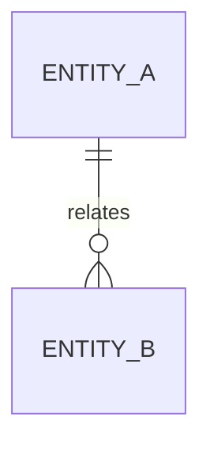

# GitHub Issue #107: TEMPLATE-UPGRADE: 细化 06-07 DB / API 契约文档规范

> Source URL: https://github.com/emily8421/ai-project-template/issues/107
> State: open
> Labels: proposal, from:LUMEN_demo_T2.1
> Author: emily8421
> Created: 2026-07-06T07:07:51Z
> Updated: 2026-07-06T07:07:51Z
> Mirrored at: 2026-07-06 22:57:04 +08:00
> Mirror status: raw remote issue copy for local triage; GitHub issue remains source of comments and closure state.

## Raw Issue Body

# TEMPLATE-UPGRADE: 细化 06-07 DB / API 契约文档规范

> 来源：LUMEN_demo_T2.1（emily8421/LUMEN-DEMO）派生项目回流
> 依据：`docs/research/2026-07-06-template-proposal-audit-batch-3-06-07-db-api-contract.md` Batch 3 审计报告

## 1. 背景与问题

派生项目对 `docs/06-db-design.md`、`docs/07-api-spec.md` 与 `ai/doc-standards/06-db-design.md`、`ai/doc-standards/07-api-spec.md` 做 Batch 3 只读审计时发现：当前模板已要求数据库表结构、索引、接口清单、请求响应、错误码、权限和追溯矩阵，但规范仍偏骨架，容易出现“有表、有接口列表，但 DB / API 契约不能直接指导实现和测试”的问题。

典型问题包括：

1. `06` 有表结构，但缺少数据需求概览、数据对象生命周期、敏感性和数据留存策略。
2. `06` 物理表字段先行，概念模型 / ER 图不够明确，实体关系和需求来源不易审计。
3. `06` 字段表缺少必填、默认值、约束、来源、敏感性、留存 / 删除策略等字段级契约。
4. `06` 索引、唯一约束、外键、级联、查询模式、向量 / 全文索引和性能影响未形成统一结构。
5. `06` 对迁移、初始化、seed 数据、回滚、数据修复和环境差异的要求不足。
6. `07` 有接口清单和少量示例，但缺少稳定 API-ID、逐接口请求契约、响应契约、错误契约、权限契约和兼容策略。
7. `07` 文件上传、异步任务、导入 / OCR、RAG / LLM 等接口缺少状态机、降级 / Mock、外部服务失败和幂等口径。
8. `06` 与 `07` 之间缺少 DB 字段、API 字段、权限、错误码、测试用例的双向追溯。
9. Demo / Mock / 内存仓储与真实数据库、真实接口能力之间的差异缺少记录位，容易被误写成生产能力已具备。

这些问题不依赖具体业务项目。凡是包含持久化数据库、REST API、CLI / SDK / 事件接口、文件上传、异步任务、权限隔离或 AI / 外部服务调用的派生项目，都需要更细的 `06-07` 契约规范。

## 2. 目标

细化 `06-07` 文档规范，使模板能稳定生成和审计以下链路：

```text
02 REQ / NFR / 边界场景
  → 04 模块 / 组件 / Flow
  → 05 技术栈 / 鉴权 / 错误码 / 安全 / Mock
  → 06 数据对象 / 概念模型 / 表字段 / 约束 / 迁移 / 留存
  → 07 API-ID / 请求 / 响应 / 错误 / 权限 / 兼容
  → 08 Task / 09 TC / tests / implementation
```

目标能力：

1. 每张表、每个字段、每个接口都能追溯到 REQ / NFR / 约束或明确的架构需要。
2. DB 文档能说明数据对象、生命周期、敏感性、概念模型、迁移和留存策略。
3. API 文档能按 API-ID 定义当前 Phase 的完整请求、响应、错误、权限、兼容和测试追溯。
4. DB 与 API 的字段、权限、错误和状态机能互相映射。
5. Mock / 降级 / Demo 仓储与真实 DB / API 能力不混写。
6. 06-07 输出能直接约束模型、迁移、API 层、前端调用、集成测试和验收用例。

## 3. 拟修改范围

| 文件 | 建议 |
|---|---|
| `ai/doc-standards/06-db-design.md` | 强化数据需求概览、概念模型、字段级契约、索引约束、迁移初始化、数据安全留存、实现状态差异 |
| `ai/doc-standards/07-api-spec.md` | 强化 API-ID、逐接口请求 / 响应 / 错误 / 权限 / 兼容契约、异步任务状态机、API → TC 追溯 |
| `ai/document-lifecycle-rules.md` | 可选：补充 DB / API 契约必须承接 REQ、NFR、架构模块、技术约束和安全边界 |
| `ai/prompts/docs/00-generate-or-complete-docs.md` | 生成 06-07 时要求输出字段级与接口级契约，而不只输出清单 |
| `ai/prompts/docs/04-edit-single-doc.md` | 修订 06 / 07 时提示同步 API / DB / service / tests / 09 |
| `ai/prompts/review/19-docs-evaluation.md` | E3 详细设计评估时增强 DB / API 契约完整性检查 |
| `ai/prompts/dev/02-run-task.md` | 执行 DB / API 相关任务时要求引用表字段、API-ID、错误码和 TC-ID |

## 4. 建议的 06 文档规范

### 4.1 结构建议

```markdown
# 06 数据库设计（Database Design）

## 0. 文档元信息
## 1. 数据需求概览
## 2. 概念模型
## 2.1 ER 图
## 3. 表清单
## 4. 表结构
## 5. 索引、约束与关系
## 6. 数据迁移与初始化
## 7. 数据安全与留存
## 8. 实现状态与 Mock / Demo 差异
## 9. REQ → 表 / 字段追溯矩阵
## 10. 待人工确认项
```

### 4.2 数据需求概览

建议模板要求先说明数据对象，再进入表结构：

| 数据对象 | 来源 REQ / NFR | 用途 | 生命周期 | 敏感性 | 访问边界 | 下游接口 / 模块 |
|---|---|---|---|---|---|---|

敏感性建议枚举：`公开`、`内部`、`敏感`、`个人信息`、`客户数据`、`密钥 / 凭据`、`待确认`。

### 4.3 概念模型与 ER 图

建议表格：

| 实体 | 描述 | 关联 REQ / NFR | 关系 | 阶段 | 备注 |
|---|---|---|---|---|---|

建议图表：



要求：

- 当前 Phase 实体必须有来源。
- 后续阶段实体可保留骨架，但不得提前写死字段细节。
- 无需求来源的实体不得进入当前 Phase 表结构。

### 4.4 表清单

| 表名 | 阶段 | 状态 | 用途 | 来源 REQ / NFR / 约束 | 数据对象 | 备注 |
|---|---|---|---|---|---|---|

### 4.5 表结构字段契约

当前 Phase 表字段建议至少包含：

| 字段 | 类型 | 必填 | 默认值 | 约束 | 说明 | 来源 | 敏感性 | 留存 / 删除 |
|---|---|---|---|---|---|---|---|---|

要求：

- 主键、外键、唯一、枚举、默认值、非空约束不得只写在说明里。
- 关键字段应标来源 REQ / NFR / 约束。
- 敏感字段应标数据安全要求和日志 / 外部传输限制。
- 状态字段应说明允许值和状态机，或引用状态机章节。

### 4.6 索引、约束与关系

建议表格：

| 表 | 索引 / 约束 | 字段 | 类型 | 用途 | 查询 / 写入影响 | 阶段 |
|---|---|---|---|---|---|---|

类型建议：`PK`、`FK`、`UNIQUE`、`CHECK`、`BTREE`、`GIN`、`FULLTEXT`、`VECTOR`、`PARTIAL`、`CASCADE`。

### 4.7 数据迁移与初始化

建议模板要求：

- 迁移工具：
- 迁移路径 / 命名规则：
- 初始化 / seed 数据：
- 回滚策略：
- 数据修复策略：
- 本地 / CI / 生产差异：
- 迁移验证命令：

### 4.8 数据安全与留存

| 数据 / 表 / 字段 | 安全要求 | 访问控制 | 脱敏 / 加密 | 留存 / 删除 | 外部传输限制 | 验证入口 |
|---|---|---|---|---|---|---|

要求：

- 涉及真实用户、客户、文档、日志、密钥、外部 AI 的项目必须填写。
- 无已确认要求时写“当前阶段无已确认要求”，不得留空。

### 4.9 实现状态与 Mock / Demo 差异

建议表格：

| 数据能力 | 目标设计 | 当前实现状态 | Mock / Demo 差异 | 是否等价真实能力 | 补齐时点 |
|---|---|---|---|---|---|

要求：

- 内存仓储、假数据、降级索引、Mock 外部服务不得写成真实 DB 能力已完成。
- 若当前 Phase 接受 Demo 降级，应说明升阶段补齐条件。

### 4.10 REQ → 表 / 字段追溯矩阵

| REQ / NFR / 约束 | 数据对象 | 表 | 字段 / 索引 / 约束 | 覆盖说明 | 状态 |
|---|---|---|---|---|---|

## 5. 建议的 07 文档规范

### 5.1 结构建议

```markdown
# 07 API / 接口设计（API Specification）

## 0. 文档元信息
## 1. 统一约定
## 2. 接口 / 命令清单
## 3. 请求 / 输入契约
## 4. 响应 / 输出契约
## 5. 错误码与异常处理
## 6. 权限、安全与限流
## 7. 异步任务 / 状态机（如适用）
## 8. 兼容性与版本演进
## 9. API ↔ DB / Service / Test 追溯
## 10. REQ → 接口追溯矩阵
## 11. 待人工确认项
```

### 5.2 接口 / 命令清单

建议引入稳定 API-ID：

| API-ID | 方法 / 命令 | 路径 / 名称 | 用途 | 阶段 | 状态 | 来源 REQ / NFR | 关联模块 |
|---|---|---|---|---|---|---|---|

要求：

- 当前 Phase 接口必须有 API-ID。
- 后续阶段接口可保留骨架，状态标为 `后续阶段 / 骨架`。
- 不得创建无 REQ / NFR / 架构来源的孤立接口。

### 5.3 请求 / 输入契约

当前 Phase 每个 API-ID 应有请求契约：

```markdown
### API-001：<接口名称>

- 方法 / 路径：
- 认证：
- 幂等性：
- Content-Type：

| 字段 / 参数 | 位置 | 类型 | 必填 | 校验 | 示例 | 说明 | 来源 |
|---|---|---|---|---|---|---|---|
```

位置建议：`path`、`query`、`header`、`body`、`form-data`、`file`、`cookie`、`stdin`。

### 5.4 响应 / 输出契约

当前 Phase 每个 API-ID 应有响应契约：

| 字段 | 类型 | 必填 | 示例 | 说明 | 数据来源 / 表字段 | 敏感性 |
|---|---|---|---|---|---|---|

并给出：

- 成功响应示例。
- 空结果响应示例。
- 失败响应示例。
- 分页 / 游标 / 排序规则（如适用）。
- 来源引用 / 文件 / 事件 / 退出码（如适用）。

### 5.5 错误码与异常处理

建议表格：

| 错误码 / 退出码 | HTTP 状态 / 退出码 | 触发条件 | 用户可见信息 | 前端 / 客户端处理 | 日志 / 审计 | 关联 API-ID |
|---|---|---|---|---|---|---|

要求：

- 参数校验、无权限、资源不存在、冲突、外部服务不可用、超时、降级、速率限制应有明确口径。
- 错误响应不得泄露其他空间、租户、私有资源或敏感字段。

### 5.6 权限、安全与限流

| API-ID | 鉴权 | 空间 / 租户边界 | 资源权限 | 敏感字段 | 限流 | 审计日志 | 越权失败策略 |
|---|---|---|---|---|---|---|---|

要求：

- 前端隐藏 / 禁用不作为权限边界。
- 权限必须由 API / service / query 层执行。
- 越权失败应避免泄露资源是否存在。

### 5.7 异步任务 / 状态机

涉及导入、OCR、导出、同步、长任务、外部服务时建议必填。

| 状态 | 含义 | 进入条件 | 退出条件 | 用户可见信息 | 可重试 | 终态 |
|---|---|---|---|---|---|---|

同时记录：

- 状态对应 DB 字段。
- 失败原因字段。
- 轮询 / 回调 / webhook 策略。
- 幂等键或重复提交处理。

### 5.8 兼容性与版本演进

建议模板要求：

- 版本策略：路径版本 / Header / 语义版本 / 无版本（原因）。
- 兼容原则：新增字段、字段废弃、枚举扩展、错误码变化。
- 破坏性变更处理：迁移窗口、客户端影响、回滚方案。
- 弃用策略：公告、保留周期、替代接口。

### 5.9 API ↔ DB / Service / Test 追溯

| API-ID | Service / Command | 数据来源 / 表 | 权限规则 | 错误码 | 关联测试 / TC | 状态 |
|---|---|---|---|---|---|---|

### 5.10 REQ → 接口追溯矩阵

| REQ / NFR | API-ID | 覆盖说明 | 阶段 | 状态 |
|---|---|---|---|---|

## 6. DB / API 交叉契约建议

### 6.1 字段映射

建议在 07 或 design 中保留 API 字段来源：

| API-ID | 响应字段 | 数据来源 | 表 / 字段 | 计算逻辑 | 敏感性 |
|---|---|---|---|---|---|

### 6.2 权限交叉检查

| 权限场景 | DB 过滤 / 约束 | API 校验 | 错误码 | 测试 / TC |
|---|---|---|---|---|

### 6.3 错误与约束映射

| DB / 业务约束 | 触发接口 | 错误码 | 用户可见信息 | 是否可重试 |
|---|---|---|---|---|

## 7. Prompt 增强建议

### 7.1 `generate-docs`

生成 06-07 时应要求：

- 06 输出数据对象、概念模型、ER 图、字段级契约、索引约束、迁移初始化、安全留存和 Mock / Demo 差异。
- 07 输出 API-ID、逐接口请求 / 响应 / 错误 / 权限契约、异步状态机、兼容策略和 API ↔ DB / Test 追溯。
- 当前 Phase 写完整契约，后续 Phase 只留骨架且标 `后续阶段`。

### 7.2 `edit-single-doc`

修订 06 或 07 时应提示：

- 是否新增 / 删除 / 修改表、字段、索引、约束、接口、错误码或状态机。
- 是否影响 service、model、frontend、tests、09 TC、迁移文件和 seed 数据。
- 是否涉及敏感字段、权限、数据留存、外部服务或真实数据。
- 是否需要同步对应的 06 ↔ 07 交叉契约。

### 7.3 `docs-evaluation`

E3 详细设计评估应增加检查：

- 是否存在无 REQ / NFR 来源的表、字段或接口。
- 当前 Phase API 是否只有清单、缺少逐接口契约。
- DB / API 权限边界是否一致。
- 错误码、状态机、Mock / 降级是否可验收。
- 06 / 07 是否能直接指导实现和集成测试。

### 7.4 `run-dev-task`

执行 DB / API 相关任务前，应要求方案引用：

- 表名 / 字段 / 索引 / 迁移。
- API-ID / 请求 / 响应 / 错误码 / 权限。
- 关联 TC-ID 或测试文件。
- Mock / 降级边界。

## 8. 兼容与迁移建议

对已存在派生项目，不建议强制重写 06-07。建议渐进迁移：

1. 先为当前 Phase 接口补 API-ID。
2. 为当前 Sprint 涉及的 API 补请求、响应、错误和权限契约。
3. 为当前 Phase 表字段补必填、默认值、约束、来源和敏感性。
4. 补迁移 / 初始化 / seed / rollback 策略。
5. 补 DB / API 权限和错误码交叉映射。
6. 将 API-ID 和关键 DB 约束映射到 09 TC 或集成测试。
7. 历史实现若与 06 / 07 不一致，先走 `sync-docs-from-code` 或最小文档修订，不得把越界实现直接写成已批准需求。

## 9. 验收标准

本提案落地后，模板应满足：

1. 新项目生成 06 时，能说明数据对象、概念模型、表结构、字段契约、索引约束、迁移初始化和数据安全留存。
2. 新项目生成 07 时，当前 Phase 每个接口都有 API-ID、请求契约、响应契约、错误契约、权限契约和兼容策略。
3. DB 字段与 API 字段可建立映射，权限和错误码能跨 DB / API / service / test 追溯。
4. 文件上传、异步任务、外部服务、AI / OCR 等接口有状态机和失败 / 降级口径。
5. Mock / Demo / 内存仓储不会被模板引导写成真实 DB / API 能力已完成。
6. 旧项目可按最小迁移步骤补齐当前 Phase，不需要一次性重写全部 DB / API 文档。

## 10. 版本影响

建议版本：模板方法论 minor 版本升级。

影响面：

- 对新项目：06-07 会更契约化，初次文档更厚，但实现与测试偏差更少。
- 对旧项目：同步后不会自动修改项目事实文档；需要通过 `docs-evaluation`、`docs-system-audit` 或 `edit-single-doc` 按需迁移。
- 对 Prompt：生成 / 修订 / 评估 06-07 时检查项增加。
- 对脚本：原则上无需脚本变更。

## 11. 非目标

- 不要求所有项目保留 06 / 07；仍按 `ai/project-rules.md` §3 裁剪。
- 不要求 Lean 项目写完整 REST 契约；CLI / script 项目可用命令、参数、输出和退出码替代 API 字段。
- 不替代具体 ORM、迁移工具或 OpenAPI 生成工具。
- 不把派生项目的具体表名、接口路径或业务字段写入模板默认事实。
- 不替代 `docs/design/*` 子系统内部流程设计。

## 12. 待模板维护者确认

| ID | 待确认项 | AI 建议 | 建议依据 | 备选方案 | 取舍影响 / 阻塞关系 |
|---|---|---|---|---|---|
| C-001 | 是否将 API-ID 设为当前 Phase 接口必填 | 建议必填 | 便于请求 / 响应 / 错误 / 权限 / TC 追溯 | 只用方法 + 路径 | 路径变更或多方法同路径时不稳定 |
| C-002 | 是否将 DB 字段敏感性 / 留存字段设为条件必填 | 建议涉及用户、文档、客户、日志、外部 AI 时必填 | 数据安全需要字段级锚点 | 仅在安全章节概括 | 容易漏字段级风险 |
| C-003 | 是否要求异步任务状态机为条件必填 | 建议涉及上传、导入、导出、同步、外部服务时必填 | 前后端、DB、测试需统一状态语义 | 只在接口描述中自然语言说明 | 容易导致状态不一致 |
| C-004 | 是否将 06 / 07 合并为一个模板优化主题 | 建议本次合并优化 | DB / API 在字段、权限、错误和测试上强耦合 | 拆成两个提案 | 更细但重复较多 |
