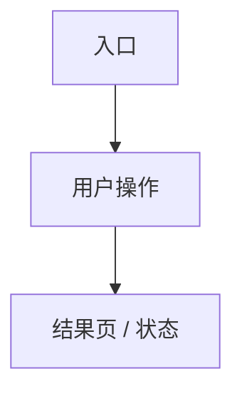

# Frontend Interaction Scaffold（前端交互设计结构模板）

> Sync notice: This file is maintained by `ai-project-template` and may be overwritten when a derived project syncs template methodology.
> Do not edit it directly in derived projects; propose reusable changes in `_proposals/` and upstream them to the template repository.

> 推荐落盘路径：`docs/design/frontend-interaction.md`，多入口项目可拆为 `docs/design/*interaction*.md`
> 对应标准：`ai/doc-standards/frontend-interaction.md`
> 定位：前端实现前的页面 / 交互详细设计；只细化已授权需求、接口和验收路径，不新增需求、接口或权限规则。

## 0. 文档元信息

【撰写提要：说明适用产品入口、Phase、状态、上游文档、原型证据和验收引用。】

| 字段 | 内容 |
|---|---|
| 适用入口 | Web / App / Admin / Desktop / 其他 |
| 适用 Phase | |
| 状态 | 草案 / 待确认 / P{N}-已设计 / P{N}-已实现 |
| 上游依据 | `REQ-ID`、`docs/03-prd.md`、`docs/04-architecture.md`、`docs/05-tech-spec.md`、`docs/07-api-spec.md` |
| 原型证据 | Figma / Penpot / Storybook / 代码原型 / 截图标注 / 无 |

## 1. 页面 / 路由清单与 REQ 追溯

【撰写提要：列出页面、路由、用户目标和需求来源；每个页面必须能追溯到 REQ 或明确非功能约束。】

| Page-ID | 页面 / 路由 | 用户目标 | 来源 REQ / NFR | Phase | TC-ID |
|---|---|---|---|---|---|
| PAGE-001 | | | | | |

## 2. 角色、入口与权限可见性

【撰写提要：说明角色看到什么、不能看到什么；前端隐藏 / 禁用不是权限边界，权限必须由后端接口和服务层执行。】

| 角色 | 入口 | 可见能力 | 禁用 / 隐藏 | 后端权限依据 |
|---|---|---|---|---|
| | | | | |

## 3. 核心用户流与点击路径

【撰写提要：描述主流程、关键分支、返回路径和验收点击路径。】

| Flow-ID | 用户流 | 起点 | 关键步骤 | 终点 | 异常分支 |
|---|---|---|---|---|---|
| UI-FLOW-001 | | | | | |

## 4. 页面信息架构与组件职责

【撰写提要：按页面拆解区域、组件、信息密度、输入输出和状态归属。】

| Page-ID | 区域 / 组件 | 职责 | 输入 | 输出 | 依赖 |
|---|---|---|---|---|---|
| | | | | | |

## 5. 页面状态、表单校验与文案

【撰写提要：覆盖加载、空态、错误、禁用、成功、无权限、降级、风险提示和关键文案。】

| Page-ID / Component | 状态 | 触发条件 | 用户可见文案 | 操作 | TC-ID |
|---|---|---|---|---|---|
| | Loading / Empty / Error / Disabled / Success / Forbidden / Degraded | | | | |

## 6. 接口依赖与数据可见性

【撰写提要：引用 `docs/07-api-spec.md` 的 API-ID、错误码、权限和敏感字段处理；不得在本文创造接口契约。】

| Page-ID | API-ID / 数据源 | 用途 | 错误处理 | 权限 / 脱敏 | 状态 |
|---|---|---|---|---|---|
| | | | | | |

## 7. 响应式、可访问性与兼容范围

【撰写提要：说明设备 / 浏览器范围、断点、键盘 / 屏幕阅读器等要求；不适用时说明理由。】

| 维度 | 范围 / 要求 | 验证方式 |
|---|---|---|
| 响应式 | | |
| 浏览器 / 设备 | | |
| 可访问性 | | |

## 8. UI 原型与可视化证据

【撰写提要：记录原型形式、权威位置、覆盖页面 / 状态 / 设备范围和未覆盖项；原型不替代需求、设计或验收。】

| 证据类型 | 位置 | 覆盖范围 | 未覆盖项 | 回填关系 |
|---|---|---|---|---|
| | | | | |

## 9. 验收路径与 TC 追溯

【撰写提要：把页面、用户流、状态映射到 `docs/09-verification.md`。】

| 验收项 | Page-ID / Flow-ID | TC-ID | 步骤 | 通过标准 |
|---|---|---|---|---|
| | | | | |

## 10. 阶段增量与实现偏差

【撰写提要：按 Phase 记录页面能力状态；实现后回写偏差和补做项。】

| Phase | 页面 / 能力 | 状态 | 偏差 / 风险 | 后续动作 |
|---|---|---|---|---|
| | | | | |

## 11. 待人工确认项

【撰写提要：交互、文案、权限可见性、原型取舍等无法由 AI 代决时，在此结构化记录。】

| ID | 待确认项 | AI 建议 | 建议依据 | 备选方案 | 取舍影响 / 阻塞关系 |
|---|---|---|---|---|---|
| C-001 | | | | | |
