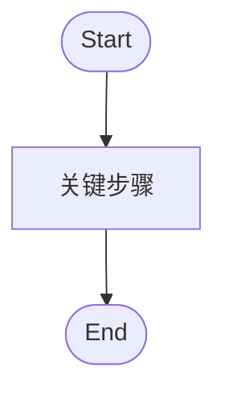

# Subsystem Design Scaffold（子系统详细设计结构模板）

> Sync notice: This file is maintained by `ai-project-template` and may be overwritten when a derived project syncs template methodology.
> Do not edit it directly in derived projects; propose reusable changes in `_proposals/` and upstream them to the template repository.

> 推荐落盘路径：`docs/design/<subsystem>.md`
> 对应标准：`ai/doc-standards/design-doc.md`
> 定位：非平凡子系统 / 跨模块流程 / 复杂状态机 / 外部集成 / 安全边界的详细设计；承接 `03-07`，不新增未授权需求、接口、表字段或验收目标。

## 0. 文档元信息

【撰写提要：说明设计对象、适用 Phase、状态、负责人、更新时间、上游依据和当前实现状态。】

| 字段 | 内容 |
|---|---|
| 设计对象 | `<subsystem>` |
| 适用 Phase | `[P1] / [P2] / [愿景]` |
| 状态 | `草案 / 待人工确认 / P{N}-已设计 / P{N}-已实现` |
| 上游依据 | `REQ-ID`、`docs/04-architecture.md`、`docs/05-tech-spec.md`、`docs/06-db-design.md`、`docs/07-api-spec.md` |
| 关联验证 | `TC-ID` / `docs/09-verification.md` |

## 1. 职责与边界

【撰写提要：定义子系统负责什么、不负责什么、与其他模块的边界和禁止越界事项。】

| 项 | 说明 |
|---|---|
| 核心职责 | |
| 不负责 | |
| 输入 | |
| 输出 | |
| 依赖 | |
| 禁止事项 | |

## 2. 上游依据与追溯

【撰写提要：列出每个设计点对应的 REQ / NFR / Phase / COMP / MOD / Flow / API / TC，避免无来源设计。】

| 设计点 | 来源 REQ / NFR | Phase | 架构 / 模块 | API / DB 引用 | TC-ID |
|---|---|---|---|---|---|
| | | | | | |

## 3. 核心流程 / 状态机

【撰写提要：用文字、表格或 mermaid 描述关键流程、状态转换、异常分支和终止条件。】

### Flow-D-001：<流程名称>

| 步骤 | 触发 | 输入 | 处理 | 输出 | 失败 / 降级 |
|---|---|---|---|---|---|
| 1 | | | | | |

## 4. 数据、接口与权限契约

【撰写提要：引用 `06/07` 中已定义的表、字段、API-ID、错误码和权限边界；不得在本文单独创造契约。】

| 契约类型 | 引用 | 使用方式 | 权限 / 安全要求 | 状态 |
|---|---|---|---|---|
| DB | `docs/06-db-design.md` | | | |
| API | `docs/07-api-spec.md` | | | |
| 权限 | `docs/07-api-spec.md` / 服务层 | | | |

## 5. 失败、异常与降级路径

【撰写提要：列出失败模式、用户可见影响、降级策略、恢复方式和验证入口。】

| 场景 | 触发条件 | 用户影响 | 降级 / 回退 | 证据 / TC |
|---|---|---|---|---|
| | | | | |

## 6. 阶段增量、readiness gate 与实现状态

【撰写提要：按 Phase 说明本阶段做什么、后续阶段预留什么、真实依赖是否满足 Go / Conditional Go / No-Go。】

| Phase | 范围 | 状态 | Readiness gate | 禁止越界 |
|---|---|---|---|---|
| P1 | | | | |

## 7. 验证与验收追溯

【撰写提要：把设计点映射到 `09` 的 TC、人工验收步骤或后续待补验证。】

| 设计点 | TC-ID | 验证方式 | 通过标准 | 未验证风险 |
|---|---|---|---|---|
| | | | | |

## 8. 与其他子系统交互

【撰写提要：列出依赖方、被依赖方、交互协议、数据共享和失败传播。】

| 相关子系统 | 关系 | 交互点 | 风险 | 回退 |
|---|---|---|---|---|
| | | | | |

## 9. 实现偏差 / 设计回写

【撰写提要：实现后若代码事实与设计不同，在这里记录偏差、原因、影响和需要回写的权威文档。】

| 日期 | 偏差 | 原因 | 影响 | 回写位置 | 状态 |
|---|---|---|---|---|---|
| | | | | | |

## 10. 待人工确认项

【撰写提要：待确认项必须包含 AI 建议、依据、备选方案、影响和阻塞关系；不得只列问题。】

| ID | 待确认项 | AI 建议 | 建议依据 | 备选方案 | 取舍影响 / 阻塞关系 |
|---|---|---|---|---|---|
| C-001 | | | | | |
