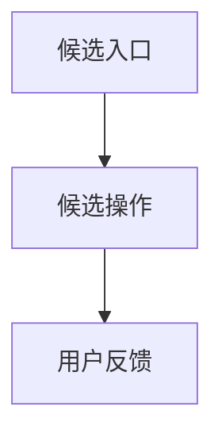

# UI Prototype Exploration Scaffold（需求探索原型记录结构模板）

> Sync notice: This file is maintained by `ai-project-template` and may be overwritten when a derived project syncs template methodology.
> Do not edit it directly in derived projects; propose reusable changes in `_proposals/` and upstream them to the template repository.

> 推荐落盘路径：`docs/research/YYYY-MM-DD-ui-prototype-exploration.md`
> 对应规则：`ai/document-lifecycle-rules.md` §5.2.1 / §10.2、`ai/prompts/docs/22-ui-prototype-exploration.md`
> 定位：正式 `00-03` 定稿前的需求探索 / 用户确认辅助材料，也可记录 UI brief 后的视觉效果探索；不是需求权威源，不替代架构、技术方案、前端交互设计或验收记录。

## 0. 文档元信息

【撰写提要：记录探索时间、参与者、原型形式、输入材料、状态和建议回填位置。】

| 字段 | 内容 |
|---|---|
| 探索日期 | YYYY-MM-DD |
| 原型主类型 | 需求探索原型 / 视觉效果探索 / 实现前 UI 原型（只能选一个；实现前 UI 原型应转 UI 原型策略） |
| 原型形式 | 低保真草图 / Figma / Penpot / 截图标注 / HTML 静态页 / 代码静态 Mock / 其他 |
| 状态 | 探索 / 待确认 / 已回填 / 暂缓 |
| 上游输入 | `docs/inputs/*`、访谈、用户描述 |
| 建议回填位置 | `docs/00-03`、`docs/design/frontend-experience-brief.md`、`frontend-interaction`、open items |

## 1. 探索目的

【撰写提要：说明本次原型要帮助确认什么，不要写成已确认需求。】

- 待澄清问题：
- 目标用户 / 角色：
- 非目标：

## 2. 目标用户与场景假设

【撰写提要：列出待验证的用户、场景、目标和成功标准；状态必须是候选 / 待确认。】

| 假设 ID | 用户 / 场景 | 假设 | 验证方式 | 状态 |
|---|---|---|---|---|
| H-001 | | | | 待确认 |

## 3. 页面 / 视图清单

【撰写提要：列出探索用页面 / 视图，不等于正式页面清单。】

| View-ID | 页面 / 视图 | 目的 | 关键内容 | 待确认点 |
|---|---|---|---|---|
| VIEW-001 | | | | |

## 4. 主流程草案

【撰写提要：记录用户如何从入口到结果；流程是候选，不得直接进入实现。】

| 步骤 | 用户动作 | 系统反馈草案 | 待确认项 |
|---|---|---|---|
| 1 | | | |

## 5. 关键状态与反馈

【撰写提要：探索加载、空态、错误、成功、无权限、降级、风险提示等状态。】

| 状态 | 触发 | 候选文案 / 表现 | 用户反馈 | 是否需回填 |
|---|---|---|---|---|
| | | | | |

## 6. 文案、信息密度与可理解性

【撰写提要：记录用户是否理解页面信息、术语、提示和操作顺序。】

| 对象 | 候选文案 / 布局 | 反馈 | 建议 |
|---|---|---|---|
| | | | |

## 6.1 视觉候选与信息架构探索

【撰写提要：记录配色、密度、布局模式、经典路径 / 探索路径、首屏观感和可读性候选；未确认前不得写入正式设计。】

| 视觉 / IA 项 | 候选方向 | 依据 | 状态 | 建议回填位置 |
|---|---|---|---|---|
| V-001 | | | 视觉候选 / 已确认视觉方向 / 视觉验证失败 | |

## 6.2 大规模 IA / 图谱 / 数据密集 UI 降级规则（如触发）

【撰写提要：当输入含大量文档、多项目、多层目录、图谱、关系图、时间轴、看板或数据密集 UI 时填写。】

| 项 | 建议 | 待确认点 | 回填位置 |
|---|---|---|---|
| 分层信息架构 | | | |
| 经典路径 / 逃生舱 | | | |
| 探索视图规模限制 | | | |
| 自动降级规则 | | | |
| 权限过滤与不可见来源口径 | | | |

## 7. 用户反馈记录

【撰写提要：记录原话摘要、观察到的困惑、明确确认和仍待确认事项。】

| 来源 | 反馈摘要 | 类型 | 处理建议 |
|---|---|---|---|
| | | 确认 / 反对 / 新需求候选 / 风险 | |

## 8. 已确认需求候选

【撰写提要：只列候选，不得直接当作已确认需求；确认后必须回填 `00-03`。】

| 候选项 | 建议回填位置 | 依据 | 状态 |
|---|---|---|---|
| | `docs/00-03` | | 待人工确认 |

## 9. 待确认假设 / Open Items

| ID | 待确认项 | AI 建议 | 建议依据 | 备选方案 | 取舍影响 / 阻塞关系 |
|---|---|---|---|---|---|
| C-001 | | | | | |

## 10. 回填与下一步

【撰写提要：说明哪些内容应回填、哪些继续探索、哪些暂缓。】

| 动作 | 目标位置 | 负责人 | 时点 | 状态 |
|---|---|---|---|---|
| 回填 | `docs/00-03` | | | 待处理 |

## 10.1 晋级 Gate

| Gate | 是否满足 | 证据 | 未满足影响 |
|---|---|---|---|
| UI-G-002：reference analysis → exploration prototype | 是 / 否 / 不适用 | | |
| UI-G-003：exploration prototype → experience brief | 是 / 否 / 不适用 | | |
| UI-G-004：prototype confirmation → document-system update | 是 / 否 / 不适用 | | |

## 11. 边界声明

【撰写提要：保留本节，防止探索原型被误用为需求 / 设计 / 验收事实。】

- 本记录不是需求权威源；确认后的内容必须回填到 `00-03`。
- 本记录不决定架构、技术栈、接口、数据库、权限或验收目标。
- 未确认内容只能进入 open items 或继续探索，不得直接进入编码。
- 视觉候选和 AI 默认 UI 建议在用户确认前不得写成正式设计事实。
- 可视化原型确认后不得绕过 `frontend-interaction`、UI 原型策略、`08`、`09` 直接编码。
